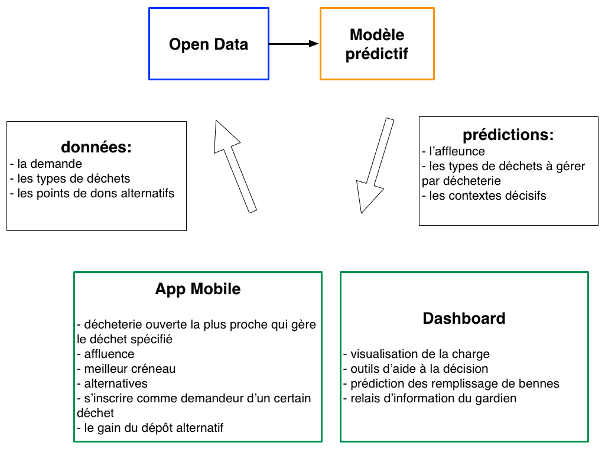

## Objectifs

En plus de  démontrer l'intérêt de l'open-data et d'alimenter le cercle vertueux de l'ouverture des données et de la transparence, ce projet à pour objectifs précis de:

- fluidifier l'accès aux déchetteries pour les usagers
- optimiser la gestion des déchets pour les collectivités (ramassage des bennes notamment)
- soutenir et faire croître une économie circulaire du déchet en proposant les alternatives aux déchetteries.

## Produits

La réalisation de ces objectifs passe par le développement des produits suivants :

- un algorithme de prédiction de l'affluence dans les déchetterie et plus généralement de la production de déchets
- un dashboard utilisant la datavisualisation pour que les collectivités puissent anticiper, optimiser et prendre des décisions
- une application mobile grand public

Voici le détail des produits avec ce qui a déjà été réalisé en vert.

### Modèle prédictif

Il s'agit d'un modèle mathématique utilisant à la fois des données passées et des données contextuelles pour faire des prédictions d'affluence dans les déchetteries.

- agrégation et nettoyage des données journalières 
- modèle prédictif à la journée 
- feature temporelle de l'année précédente
- ajouter des données contextuelles
    - jours fériés, vacances scolaires
    - météo
    - données osm
    - ...
- nettoyer les données horaires
- faire un modèle horaire

### DataViz/Dashboard

Pour l'instant, il s'agit d'une visualisation des résultats du modèle mais qui doit se déveloper au fur et à mesure en outils d'aide à la décision.

- le calendrier d3js 
- faire une map leaflet
- faire une visu genre radar pour la fréquentation horaire

### App mobile

Cette application permettra :

- d'orienter vers la déchetterie la plus adaptée au type de déchet
- de proposer le meilleur créneau
- de proposer une voie alternative (site de dons, association de récupération, autre particulier, agriculteur)
- de se renseigner comme demandeur d'un type déchet

Les étapes de développement:

- design/UX
- développement d'une première version
- crowdsourcer les premiers acteurs alternatifs
    - Emmaüs
    - associations recup'r etc
    - sites genre don.fr
    - monextel
- mettre en place un backend/api qui récupère les données de l'app
