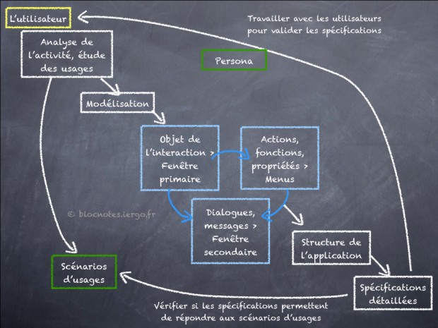

# A few tips to design an ap
## Look
GuideLine depending on OS:
* [iOs](https://developer.apple.com/library/ios/documentation/UserExperience/Conceptual/MobileHIG/index.html)
* [Android](http://developer.android.com/design/index.html)
* [WindowsPhone](http://msdn.microsoft.com/en-us/library/windows/apps/hh465424.aspx) *(lol)*

*Typo* : no Serif is better. But Georgia is fine. [JDN]

*Color* : Number max of colors : 5/7 [JDN]

*Contrast* : Clear font, dark typo [JDN]

*Font* : no pictures even transparent, plain [JDN]

*Font sizes* :  in relative terms — not as an absolute number of pixels.

*Vocabulary* : clear, user friendly [JDN]

*Pictogram* : prefer them than text [JDN] but let a legend [Opquast]

=> [Icon library](http://www.flaticon.com/free-icons/library_525)

*Waiting* : indicate with progression bar or picto [JDN]

Minimize keyboard input

*Button size & location* : too small/close occures failures. Never put two opposite (in action) buttons together [Normal Nielsen] / interactions fields [opquast]

Don't change *link color*: blue and/or underlined

*Keyboard* : think how will it look like with keyboard [[developper]](http://www.developer.com/ws/10-key-design-tips-for-great-mobile-apps.html)

### Disability

Think about **visually impaired** person like daltonien : the information is not only transmitted by color.

[Color test for disability](http://www.daltonize.org/)

## Content

from [blocnote.iergo](http://blocnotes.iergo.fr/concevoir/concevoir-une-apps-pour-mobile/)

The app needs at least one organization to **contact** [qualité web]

If everything is not reachable from homepage, we need an **app plan** reachable from anywhere *(footer)* [qualité web]

We can reach **homepage** from everywhere *(header)*

Use **users knowledge** , it will be more intuitive

Users should reach their goal in max **3 clics**

The human "empan" (work memory) is 7 (+-2) => We should not have more than 7 menus in order to remember them all 

## Usability, utility and useful
**Usability** is defined by 5 quality components:  [NN]

* Learnability: How easy is it for users to accomplish basic tasks the first time they encounter the design?
* Efficiency: Once users have learned the design, how quickly can they perform tasks?
* Memorability: When users return to the design after a period of not using it, how easily can they reestablish proficiency?
* Errors: How many errors do users make, how severe are these errors, and how easily can they recover from the errors?
* Satisfaction: How pleasant is it to use the design?

Definition of **Utility** = whether it provides the features you need.

Definition of **Usability** = how easy & pleasant these features are to use.

Definition of **Useful = usability + utility**.
     

##Biblio

[journaldunet](http://www.journaldunet.com/ebusiness/internet-mobile/ergonomie-applis-mobiles/clarte-et-lisibilite.shtml)

[Norman Nielsen](http://www.nngroup.com/articles/)

[Qualité web] : *Qualité web* , Collection Références, Elie Sloïm // Laurent Denis // Muriel de Dona // Fabrice Bonny

These authors are also members of opquast and have writen [opquast list](http://checklists.opquast.com/web-mobile/)
