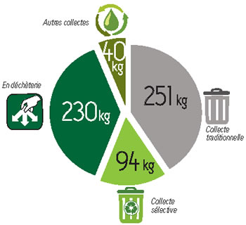
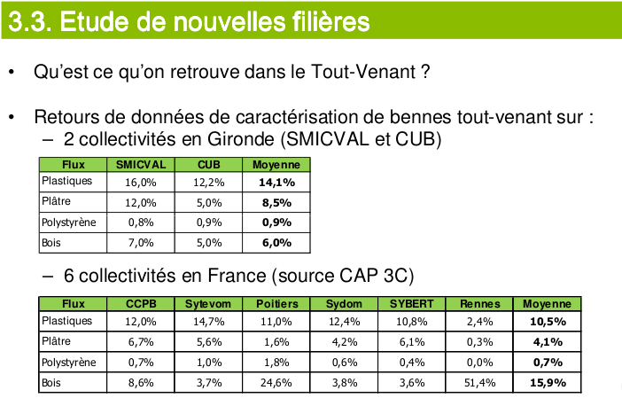
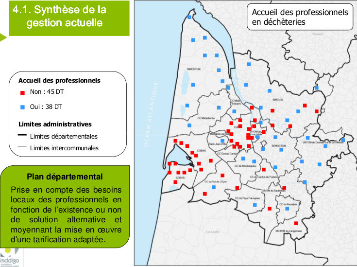

# General information about trashes

We can talk about trashes in three different ways:
* Collect  (CUB)
* Treatment (CUB)
* Planning (Department) :  They carry on **reducing and promote remaining trashes**. To do that, they elaborate a 12 years action plan, which has a prospective aim and consistent with the European project. L Vitry works on that, for instance by organizing workshops, making indicator, ... 

There are **83 recycling centers** in Gironde
There are **2 storage center** , where they bury trashes, in Gironde.

**Machines which are not broken** are not re-used and are thrown out with trashes (in Gironde). Only Ustom keep them (they sort them by themselves) and store them in a **"recyclerie" ( != recycling center)** (same concept as Emmaüs). It is located in Pessac sur Dordogne. [LV's I]

There are **3 different ways to throw out trashes** [LV's I]:
* Door to door/"Porte à porte" (**PAP**) : wast trucks
* "Point d'apport volontaire" (**PAV**): sorting point (*=borne de tri*). There are also cities which don't pick unrecycling trashes but place at residents's disposals.
* Recycling centers

**Bulky systems** (*=encombrants*) are not included in this organization because it doesn't always depend on cities. Trashes from bulky system have the same destiny if they are collected by the collectivity. Otherwise, they are usually not recycled but directly burned or burried. [LV's I]

**Compost** is currently not collected separately from the others trashes.  [LV's I]
*[Personal consideration] : That's too bad,  Idea of a new project about compost collection?*

(It is not the same organization/distribution in the entire country [LV's I])

# Users
* **Students** usually don't use recycling center [doc LV]
* Example for a given recycling center: 
* 40,000 people live in the area. 5,000 users. 96,000 visits a year [doc LV]
  * a user comes **19 times a year** in the recycling center
 * *Personal consideration* : It would be more relevant to talk about home instead of people
* People leaving in detached house with garden are the **main users** of recycling center [Vitry's interview]
* Urbans don't come in recycling center, they throw out their trashes on the street. [V's I]
* Public recycling centers are not made for **professionals** who are supposed to use private professional recycling centers. There are 5-6 in this kind in Gironde. Some local authority accept them in recycling centers but *try* to make them pay. [LV's I]

* Punctual users: punctual events such as a move or spring clean. [doc LV]
* Bigger the place we live in is, more trash we can accumulate before throwing out everything at the same time. People living in tiny places can't keep any trash and have to throw them out immediately. [doc LV]
 * *How do they solve this problem?* 
* Gardening period is from March to November [internet]

# Problems

* Some users don't trust the informations given by recycling centers  [doc LV]: 
« Dans la maison, on entasse pas mal… » « On a fait le grand rangement il n’y a pas longtemps. » « On est allé à la déchèterie la plus proche… ». « Le camion était blindé, ils étaient en grève ! ». « Du coup il y avait un tas énorme devant l’entrée de la déchèterie, mon camion était plein de merdes pendant deux semaines. Ça c’est un truc pénible, quand toi tu fais l’effort de charger ta bagnole et que c’est plein ou que c’est fermé. » 

